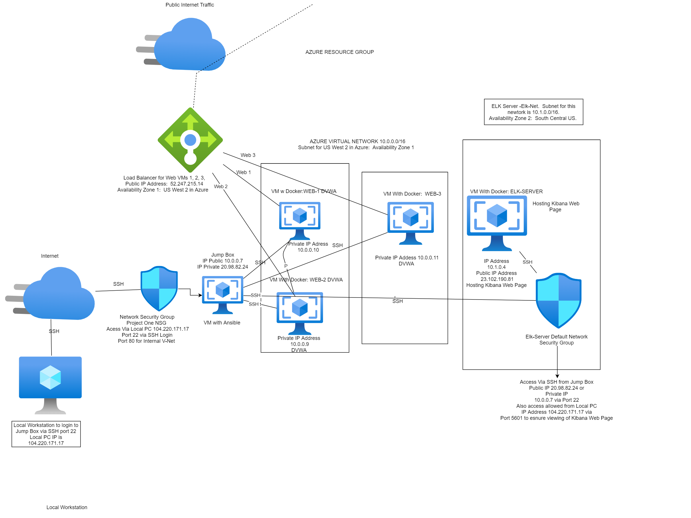
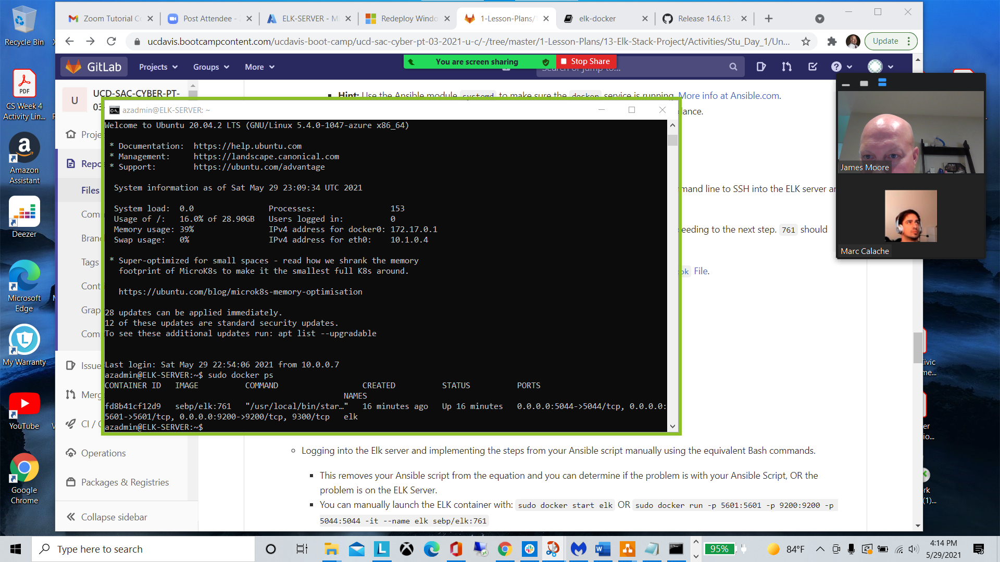

Automated ELK Stack Deployment
The files in this repository were used to configure the network depicted below.
.  
 

These files have been tested and used to generate a live ELK deployment on Azure. They can be used to either recreate the entire deployment pictured above. Alternatively, select portions of the elk,yml file may be used to install only certain pieces of it, such as Filebeat.  This document contains the following details:

•	Description of the Topology
•	Access Policies
•	ELK Configuration 
o	Beats in Use
o	Machines Being Monitored
•	How to Use the Ansible Build
Description of the Topology
The main purpose of this network is to expose a load-balanced and monitored instance of DVWA, the D*mn Vulnerable Web Application.
Load balancing ensures that the application will be highly available, in addition to restricting inbound access to the network.  The Load Balancer ensures the work to process the incoming web traffic will be shared by all 3 of the vulnerable Web Servers.  Access controls that have been set in place in Azure, that will ensure that only the authorized users (in this case, myself) will be able to connect with them in the first place.  
Integrating an ELK server allows users to easily monitor the vulnerable VMs for changes to the file systems of the Virtual Machines on the network and as well as watch system metrics, such as CPU Usage, attempted SSH logins, sudo usage and sudo escalation failures.  We can also monitor CPU usage, and web traffic (increases that would indicate a DoS attack) with our Metricbeat monitoring.  
•	FILEBEAT:  We use Filebeat to monitor and detect changes to our file systems.  In this instance we are using it to monitor and collect Apache Logs.  
•	METRICBEAT:  Metricbeat is used to detect changes in our systems metrics.  This can include SSH logins, CPU Usage, which users are using Sudo commands as well as failed Sudo escalation attempts.  We can also use it to monitor RAM and CPU statistics.  
The configuration details of each machine may be found below.
Name	Function	IP Address	Operating System
Jump Box	Gateway	10.0.0.7	Linux/Ubuntu 
Web Server 1	Web Server 	10.0.0.10	Linux/Ubuntu 
Web Server 2	Web Server 	10.0.0.9	Linux/Ubuntu 
Web Server 3 
	Web Server 	10.0.0.11	Linux/Ubuntu 
Elk Server 	Monitoring 	10.1.0.4	Linux/Ubuntu 
Elk Server Configuration Overview
The Elk VM that is being used utilizes an Elastic Stack.  Docker was used to download and manage the ELK container.  In order to eliminate the task of having to configure ELK manually, a reusable Ansible Playbook was created to accomplish this task.  The Elk.yml Ansible Playbook will be included below.  In order to use this Ansible Playbook, first the user logs into the Jump Box from their local machine.  Once in the Jump Box and is in the Ansible Container, the user issues the following command:  ansible-playbook install_elk.yml elk.  Once this is run, it will install the install_elk.yml playbook on the ELK Host.  
Access Policies
The machines on the internal network are not exposed to the public Internet.
Only the Jump Box machine can accept connections from the Internet. Access to this machine is only allowed from the following IP address IP 20.98.82.24
•	Load Balancer IP:  52.247.215.14
•	We have set up our Load Balancer in Azure in front of all machines except our Jump Box.  The load balancers targets are arranged in the following availability zones.  
A.	 Availability Zone 1:  DVWA 1, DVWA 2, DVWA 3. 
B.	Availability Zone 2:  ELK Server. 
Machines within the network can only be accessed by our Jump Box.  We SSH into our Jump Box from our local machine using GitBash.  Once we access our Jump Box we launch our Ansible Container, while operating as root in our Ansible Container we can SSH into Web Server 1, 2 & 3 as well as the Elk Server.  While in Ansible we can launch our Elk.yml, Filbeat-playbook.yml and Metricbeat-playbook.yml scripts to launch our Kibana Web Server and monitoring.  While in Ansible we can also run our Pentest.yml to launch our DVWA Web server page.  
•	The only machine we allow to access your ELK VM is our Jump Box.   The IP address of my Jump Box is:  20.98.82.24.  In this deployment the ELK VM was usually logged into via SSH while in our Docker Ansible Container.  
The Virtual Machines within this network can only be accessed by each other.  The DVWA 1, 2 & 3 send traffic to the Elk Server which is hosting and running our Kibana monitoring website.  
A summary of the access policies in place can be found in the table below.
Name	Publicly Accessible	Allowed IP Addresses
Jump Box	Yes	Public 20.98.82.24/ Private 10.0.0.4
Elk Server	No 	Private 10.1.0.4/Public 23.102.190.81
DVWA 1	No 	Public IP (Load Balancer) 52.247.215.14 / Private 10.0.0.10
DVWA 2	No 	Public IP (Load Balancer) 52.247.215.14 / Private 10.0.0.9
DVWA 3	No 	Public IP (Load Balancer) 52.247.215.14 / Private 10.0.0.11
		
		
Elk Server Configuration
Ansible was used to automate configuration of the ELK machine. No configuration was performed manually, which is advantageous because...
•	What is the main advantage of automating configuration with Ansible?
The primary benefit of Ansible is it allows IT administrators to automate away the drudgery from their daily tasks. That frees them to focus on efforts that help deliver more value to the business by spending time on more important tasks. This creates opportunity for: 
•	 Save time and be more productive
•	Eliminate repetitive tasks
•	Fewer mistakes & errors
•	Improve collaboration and job satisfaction

The playbook implements the following tasks:
•	Configure the ELK VM with Docker 
•	Install the docker.io
•	Install python3-pip 
•	Increase the virtual memory
•	Install and launch the Docker Elk Container using published ports:  5601:5601, 9200:9200, 5044:5044.  
The following screenshot displays the result of running docker ps after successfully configuring the ELK instance.

 
The install_elk.yml playbook is duplicated below:  

---
- name: Configure Elk VM with Docker
  hosts: elk
  remote_user: azadmin
  become: true
  tasks:
    # Use apt module
    - name: Install docker.io
      apt:
        update_cache: yes
        name: docker.io
        state: present

      # Use apt module
    - name: Install pip3
      apt:
        force_apt_get: yes
        name: python3-pip
        state: present

      # Use pip module
    - name: Install Docker python module
      pip:
        name: docker
        state: present

      # Use sysctl module
    - name: Use more memory
      sysctl:
        name: vm.max_map_count
        value: "262144"
        state: present
        reload: yes

      # Use docker_container module
    - name: download and launch a docker elk container
      docker_container:
        name: elk
        image: sebp/elk:761
        state: started
        restart_policy: always
        published_ports:
          - 5601:5601
          - 9200:9200
          - 5044:5044

      # Use systemd module
    - name: Enable service docker on boot
      systemd:
        name: docker
        enabled: yes

 Target Machines & Beats
This ELK server is configured to monitor the following machines:
•	DVWA 1 (10.0.0.10) DVWA 2 (10.0.0.9) DVWA 3 (10.0.0.11) 
We have installed the following Beats on these machines:
•	Filebeat
•	Metricbeat 
These Beats allow us to collect the following information from each machine:
•	Filebeat:  Filebeat allows a user to detect changes to the filesystems being used.  In this instance we are using it to collect Apache logs. 
•	Metricbeat:  Metricbeat allows a user to detect changes in the system metrics.  This can include CPU usage, CPU and RAM statistics, SSH logins or SSH login attempts. Sudo usage and Sudo escalation attempts by users.  
The playbook below can be used to install Filebeat on the selected hosts.  The Metricbeat playbook is not included here, but all you really have to do is edit the playbook and where it says “Filebeat” replace it with “’Metricbeat” and it will work the same way and install Metricbeat.  

---
- name: Configure Elk VM with Docker
  hosts: elk
  remote_user: azadmin
  become: true
  tasks:
    # Use apt module
    - name: Install docker.io
      apt:
        update_cache: yes
        name: docker.io
        state: present

      # Use apt module
    - name: Install pip3
      apt:
        force_apt_get: yes
        name: python3-pip
        state: present

      # Use pip module
    - name: Install Docker python module
      pip:
        name: docker
        state: present

      # Use sysctl module
    - name: Use more memory
      sysctl:
        name: vm.max_map_count
        value: "262144"
        state: present
        reload: yes

      # Use docker_container module
    - name: download and launch a docker elk container
      docker_container:
        name: elk
        image: sebp/elk:761
        state: started
        restart_policy: always
        published_ports:
          - 5601:5601
          - 9200:9200
          - 5044:5044

      # Use systemd module
    - name: Enable service docker on boot
      systemd:
        name: docker
        enabled: yes

Using the Playbook
In order to use the playbook, you will need to have an Ansible control node already configured. Assuming you have such a control node provisioned:
1.	Copy the playbooks to the Ansible Control Node. 
2.	Run each playbook on the appropriate target machines.  
SSH into the control node and follow the steps below:
•	Copy the playbook.yml files to Ansible. (cd /etc/ansible/files/.) If you don’t have a files directory in /etc/ansible, then create one for the playbooks. You will need to copy the elk.yml file to /etc/ansible. 
•	Then copy the metricbeat-config.yml, filebeat-config.yml, metricbeat-playbook.yml, and filebeat-playbook.yml to the etc/ansible/files/ directory. 
•	Update the Ansible Hosts file to include the IPs of the Host IPs (Web Server 1, 2, and 3 and the Elk Server.) Make sure to label these correctly.  Update the Webservers under the #Webservers section and the Elk Server in the #Elk section so it sees them correctly. This ensures it copies and runs the correct playbook in the correct place.  
•	[webservers] 
•	10.0.0.10
•	10.0.0.11
•	[elk]
•	10.1.0.4
•	Run the playbook and navigate to ELK Server to check that the installation worked as expected.

After you’ve completed these steps, the commands below will run the playbooks and installation on the correct machines: 
$ cd /etc/ansible
$ ansible-playbook install_elk.yml elk
$ ansible-playbook /etc/ansible/files/filebeat-playbook.yml
$ ansible-playbook /etc/ansible/files/metricbeat-playbook.yml
To get the DVWA on the Webservers up and running use this command: 
$ ansible-playbook /etc/ansible/pentest.yml
Once you’ve run the playbooks on the correct machines give them 5-15 minutes to start up and go into your Web Browser.  Use the IP address of your Load Balancer to check the DVWA Web page:  http://52.247.215.14/setup.php.  Then go to your Kibana web page to check there as well:  http://23.102.190.81:5601/app/kibana#/home. 
If you want to check on the command line, use the curl command: 
Run:  curl http://52.247.515.14:80  for the DVWA 
Run:  curl http://23.102.190.81:5601  for the Kibana web page. 
If they are working properly, it should print HTML to your terminal. 

